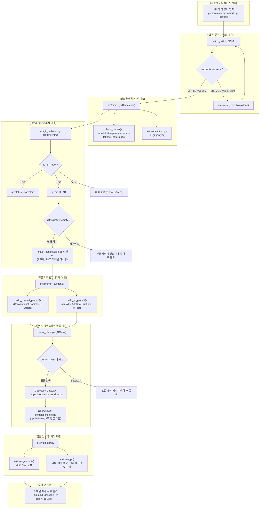
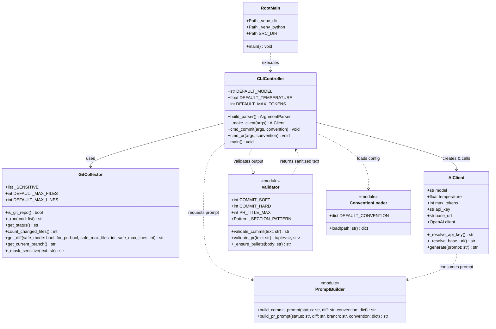
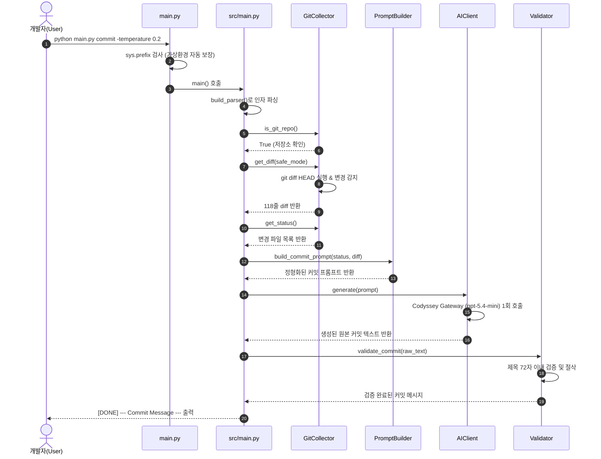
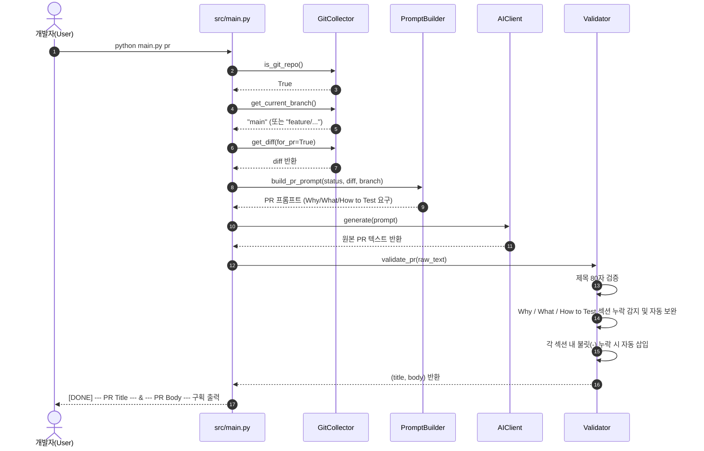

# AI 기반 Git 커밋/PR 자동 생성기 - 코드베이스 아키텍처 및 폴더 색인 가이드

> **문서 개요**: 본 문서는 `b3_2` (내가 고친 코드 설명을 AI가 대신 써주는 도우미) 프로젝트의 전체 디렉토리 구조, 파일별 역할과 책임, 클래스 다이어그램, 실행 순서도 및 시퀀스 다이어그램을 다각도로 시각화한 종합 아키텍처 가이드입니다.

---

## 1. 전체 디렉토리 구조 (Directory Tree)

```text
b3_2/
├── .env                       # 로컬 환경변수 (AI_API_KEY, AI_API_BASE_URL, AI_MODEL 등, .gitignore)
├── .env.example               # 환경변수 템플릿 예시 파일
├── .gitignore                 # Git 추적 제외 목록 (.venv, .env, __pycache__ 등)
├── .ai-gitgen.yml             # 컨벤션 커스터마이징 설정 파일
├── main.py                    # 루트 엔트리포인트 (자동 .venv 전환 및 src 모듈 실행)
├── README.md                  # 프로젝트 종합 사용 안내서
├── activity_log.md            # 안티그래비티 작업 메모리 및 변경 이력 로그
├── chat.md                    # 개발 및 디버깅 대화 히스토리
│
├── src/                       # 핵심 소스 코드 디렉토리
│   ├── main.py                # CLI 인자 파서(argparse) 및 커맨드 디스패처 (commit, pr)
│   ├── ai_client.py           # AI API 연동 클라이언트 (OpenAI 호환, 자동 게이트웨이 라우팅)
│   ├── git_collector.py       # Git 서브프로세스 제어기 (status, diff, 브랜치 수집 및 마스킹)
│   ├── prompt_builder.py      # 프롬프트 엔지니어링 빌더 (커밋 템플릿, PR 3대 섹션)
│   ├── validator.py           # 출력 텍스트 검증기 (제목 72/80자 절삭, 필수 섹션/불릿 강제)
│   ├── convention.py          # .ai-gitgen.yml 컨벤션 설정 파일 로더
│   └── requirements.txt       # 프로젝트 Python 의존성 목록
│
├── tests/                     # 자동화 단위 테스트 디렉토리
│   └── test_assistant.py      # 14개 전 기능 회귀 테스트 (Collector, Client, Validator, CLI Parser)
│
├── docs/                      # 프로젝트 및 미션 공식 문서
│   ├── b6-2-mission.md        # 미션 원본 요구사항 및 5대 과제 목표 해설서
│   ├── EVALUATION.md          # 동료 평가(Peer Review) 원본 평가 문항
│   ├── EVALUATION_PLAN.md     # 6단계 동료 평가 완벽 대비 계획서
│   ├── CONVENTIONS.md         # 4단락 커밋 메시지 작성 컨벤션 표준
│   └── B3_2미션 - AI 도구 학습.pdf # 미션 원본 PDF 교재
│
└── study/                     # 아키텍처 및 학습 자료
    └── folder_index.md        # [본 문서] 코드베이스 아키텍처 및 폴더 색인 가이드
```

---

## 2. 파일별 역할 및 책임 명세 (File Directory Index)

| 파일 경로 | 상대 경로 링크 | 계층(Layer) | 주요 역할 및 핵심 책임 |
| :--- | :--- | :---: | :--- |
| **`main.py`** | [../main.py](../main.py) | **Entry** | • 루트 실행 엔트리포인트<br>• `sys.prefix` 기반 가상환경(`.venv`) 자동 감지 및 `os.execv` 재실행<br>• `src/` 디렉토리를 `sys.path`에 주입 후 `src.main.main()` 호출 |
| **`src/main.py`** | [../src/main.py](../src/main.py) | **CLI / Controller** | • CLI 옵션 파서 구축 (`build_parser`): `--model`, `--temperature`, `--max-tokens`, `--safe-mode` 등<br>• 서브커맨드 앞/뒤 옵션 상속(`argparse.SUPPRESS`) 지원<br>• `cmd_commit`, `cmd_pr` 오케스트레이션 및 구획화된 최종 출력 |
| **`src/git_collector.py`** | [../src/git_collector.py](../src/git_collector.py) | **Infrastructure** | • `GitCollector` 클래스 구현<br>• `subprocess.run` 기반 `is_git_repo`, `get_status`, `get_diff`, `get_current_branch` 실행<br>• Staged/Unstaged 통합 diff 수집 및 변경 부재 시 조기 정상 종료(`sys.exit(0)`)<br>• 안전 모드(`-safe-mode`): 정규식 9종 민감정보 마스킹 및 diff 줄/파일 수 절삭 |
| **`src/ai_client.py`** | [../src/ai_client.py](../src/ai_client.py) | **AI Client** | • `AIClient` 클래스 구현<br>• `AI_API_KEY` 환경변수 우선 탐색 및 `sk-cody-` 키 감지 시 Codyssey Gateway 자동 라우팅<br>• 1회 정밀 호출(`generate`) 및 모델/호출 횟수 로깅<br>• 인증 실패/누락 시 스택 트레이스 없는 표준 가이드 출력 후 종료 |
| **`src/prompt_builder.py`** | [../src/prompt_builder.py](../src/prompt_builder.py) | **Domain / Prompt** | • `build_commit_prompt`: Conventional Commits 규격, 제목 1줄, 본문 불릿 및 변경 파일 포함 프롬프트 생성<br>• `build_pr_prompt`: 브랜치 맥락 주입 및 `## Why`, `## What`, `## How to Test` 템플릿 프롬프트 생성<br>• 네거티브 프롬프트를 통한 마크다운 코드 블록 및 잡담 배제 |
| **`src/validator.py`** | [../src/validator.py](../src/validator.py) | **Domain / Validator** | • 소프트웨어 차원의 결정론적 사후 검증 및 후처리(Post-processing)<br>• 커밋 제목 72자, PR 제목 80자 초과 시 하드 컷 절삭(`[WARN]` 출력)<br>• PR 3대 필수 섹션 누락 감지 및 기본 템플릿 자동 보충(Fallback)<br>• 섹션별 최소 1개 이상의 `- ` 불릿 자동 보충 |
| **`src/convention.py`** | [../src/convention.py](../src/convention.py) | **Configuration** | • `.ai-gitgen.yml` 설정 파일 로드 및 기본 컨벤션 딕셔너리 제공 |
| **`tests/test_assistant.py`** | [../tests/test_assistant.py](../tests/test_assistant.py) | **Testing** | • 전체 14개 자동화 단위 테스트 스위트 (unittest)<br>• `GitCollector`, `AIClient`, `PromptBuilder`, `Validator`, `CLIParser` 회귀 테스트 |
| **`docs/b6-2-mission.md`** | [../docs/b6-2-mission.md](../docs/b6-2-mission.md) | **Documentation** | • B3-2 미션 원본 명세 및 5대 과제 목표 / 6대 기능 요구사항 공식 해설서 |
| **`docs/EVALUATION_PLAN.md`**| [../docs/EVALUATION_PLAN.md](../docs/EVALUATION_PLAN.md) | **Documentation** | • 동료 평가 6단계(문항-요구사항-구현-검증-증빙-설명) 완벽 대비 계획서 |
| **`docs/CONVENTIONS.md`** | [../docs/CONVENTIONS.md](../docs/CONVENTIONS.md) | **Documentation** | • 4단락(Why, What, Impact, Verification) 커밋 메시지 작성 표준 |
| **`activity_log.md`** | [../activity_log.md](../activity_log.md) | **Memory / Log** | • 안티그래비티 작업 메모리 및 단계별 의사결정 히스토리 (규칙 7 준수) |

---

## 3. 시스템 계층 아키텍처 (System Architecture)



---

## 4. 객체 모델 및 클래스 다이어그램 (Class Diagram)



---

## 5. 실행 순서도 및 워크플로우 (Sequence Diagrams)

### 5.1 커밋 메시지 자동 생성 시퀀스 (`python main.py commit`)



---

### 5.2 PR 초안 자동 생성 시퀀스 (`python main.py pr`)



---

### 5.3 안전 모드 및 보안 필터링 워크플로우 (`-safe-mode`)

```mermaid
flowchart LR
    RawDiff["원본 Git Diff 텍스트"] --> SafeCheck{"-safe-mode 활성화 ?"}
    SafeCheck -- "No" --> DirectReturn["원본 Diff 그대로 반환"]
    
    SafeCheck -- "Yes" --> RegexMask["정규표현식 기반 민감정보 마스킹"]
    
    subgraph MaskingEngine["9종 민감정보 마스킹 패턴"]
        M1["OpenAI/OpenRouter 키 → [MASKED_API_KEY]"]
        M2["Anthropic 키 → [MASKED_ANT_KEY]"]
        M3["AWS Access Key → [MASKED_AWS_KEY]"]
        M4["JWT Token → [MASKED_JWT]"]
        M5["PEM Private Key → [MASKED_PEM_KEY]"]
        M6["API/Secret Key 할당문 → key=[MASKED]"]
        M7["이메일 주소 → [MASKED_EMAIL]"]
        M8["신용카드 번호 → [MASKED_CC]"]
    end
    
    RegexMask --> MaskingEngine
    MaskingEngine --> LimitCheck{"파일 수 / 줄 수 한도 초과 ?"}
    LimitCheck -- "Yes" --> Truncate["최대 10개 파일 / 최대 200줄로 절삭<br>+ [Diff truncated...] 안내 주입"]
    LimitCheck -- "No" --> SafeReturn["안전 마스킹 완료된 Diff 반환"]
    Truncate --> SafeReturn
    SafeReturn --> AIInput["AI 프롬프트 컨텍스트로 전달"]
```



---

## 6. 핵심 설계 원칙 및 아키텍처 결정 사항 (ADR)

1. **원스톱 투명 가상환경 전환 (Transparent Auto-venv Redirection)**
   - **배경**: 사용자의 터미널 환경에 따라 `source .venv/bin/activate`를 실행하지 않거나 전역 별칭(`alias python=...`)이 걸려 있어 `ModuleNotFoundError`가 발생하는 문제 방지.
   - **결정**: `main.py`와 `src/main.py` 시작부에서 `sys.prefix`를 검사하여 가상환경 외부에서 실행된 경우 `os.execv`로 즉시 `.venv/bin/python`으로 프로세스를 교체 실행.

2. **비용 및 속도 최적화 (1회 정밀 호출 & gpt-5.4-mini)**
   - **배경**: 다단계 대화나 불필요한 재생성은 응답 시간을 지연시키고 API 토큰 비용을 급증시킴.
   - **결정**: 1회 실행당 단 1회의 정밀 프롬프트 호출 원칙을 고수하며, Codyssey 프록시 최저 차감(0.5배) 모델인 `gpt-5.4-mini`를 기본 채택하여 ~1.5초 이내 완료.

3. **결정론적 사후 검증 파이프라인 (Deterministic Post-Validation)**
   - **배경**: LLM은 확률적 생성을 하므로 글자 수 초과, 필수 섹션 누락, 불릿 누락 등의 편차가 발생할 수 있음.
   - **결정**: API를 재호출하지 않고 [src/validator.py](../src/validator.py)를 통해 문자열 하드 컷, 섹션 폴백, 불릿 강제 삽입을 소프트웨어 차원에서 100% 보장.

4. **Clean Git 상태 조기 판별 (Clean Repo Early Exit)**
   - **배경**: 변경 사항이 없는 상태에서 AI API를 호출하거나 이전 커밋(`HEAD~1`)을 읽어 잘못된 커밋/PR을 생성하는 버그 차단.
   - **결정**: `diff.strip()` 검사로 변경 사항이 없을 시 안내 메시지를 출력하고 `sys.exit(0)`으로 즉시 정상 종료.

---

## 7. 관련 문서 및 소스 링크

- **루트 사용 안내서**: [README.md](../README.md)
- **동료 평가 계획서**: [docs/EVALUATION_PLAN.md](../docs/EVALUATION_PLAN.md)
- **미션 요구사항 해설서**: [docs/b6-2-mission.md](../docs/b6-2-mission.md)
- **커밋 메시지 컨벤션**: [docs/CONVENTIONS.md](../docs/CONVENTIONS.md)
- **단위 테스트 스위트**: [tests/test_assistant.py](../tests/test_assistant.py)
