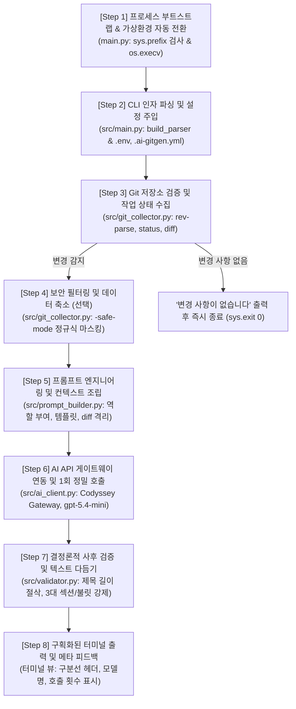

# AI Git Assistant - 실행 단계별 동작 상세 분석서 (Project Execution Deep Dive)

> **문서 개요**: 본 문서는 `python main.py commit` 또는 `python main.py pr` 명령어를 터미널에서 실행했을 때, 프로그램 내부에서 **어떤 순서로 어떤 일이 일어나는지(Execution Lifecycle)** 를 개요부터 로우 레벨 구현 상세까지 단계별로 정밀 분석한 문서입니다.

---

## 1. 실행 흐름 개요 (High-Level Overview)

사용자가 터미널에서 엔터를 치는 순간부터 최종 메시지가 터미널에 출력되기까지, 시스템은 **8단계의 엄격한 파이프라인**을 거치며 동작합니다:



---

## 2. 단계별 상세 동작 분석 (Step-by-Step Breakdown)

---

### [Step 1] 프로세스 부트스트랩 & 가상환경 자동 전환 (Bootstrap & Auto-venv)

* **실행 파일**: [`../main.py`](../main.py)
* **목적**: 사용자가 `source .venv/bin/activate`를 깜빡했거나, macOS 전역 셸 별칭(`alias python=...`)이 걸려 있어도 `ModuleNotFoundError` 없이 100% 가상환경에서 동작하도록 보장.

#### 1) 개요
사용자가 `python main.py commit`을 입력하면, 터미널 환경에 따라 글로벌 시스템 파이썬이 실행될 수 있습니다. `main.py`는 가장 먼저 현재 실행된 파이썬 인터프리터의 프리픽스(`sys.prefix`)를 검사하여 가상환경 내부인지 확인하고, 가상환경 밖이라면 즉시 `.venv/bin/python`으로 프로세스를 교체(re-exec)합니다.

#### 2) 상세 동작 매커니즘
1. **경로 판별**:
   - `_venv_dir = Path(__file__).resolve().parent / '.venv'`
   - `_venv_python = _venv_dir / 'bin' / 'python'`
2. **조건 검사**:
   - `Path(sys.prefix).resolve() != _venv_dir.resolve()` 조건을 평가합니다.
   - *주의*: `sys.executable` 파일 경로는 심링크(Symlink) 대상이 동일할 경우 전역 파이썬과 가상환경 파이썬이 같게 판별되는 오류가 있으므로, 반드시 가상환경 루트를 가리키는 `sys.prefix`로 비교합니다.
3. **프로세스 교체 (`os.execv`)**:
   - 조건이 참(가상환경 외부)이면, 새 프로세스를 생성하지 않고 현재 프로세스를 `.venv/bin/python`으로 즉시 덮어씌워 재실행합니다.
   - 인수 목록(`sys.argv`)이 그대로 보존되어 사용자가 입력한 옵션이 유실되지 않습니다.
4. **모듈 임포트 패스 설정**:
   - 가상환경 확인 후 `src/` 디렉토리를 `sys.path.insert(0, ...)`하여 내부 모듈 간의 상대/절대 임포트 충돌을 방지합니다.

---

### [Step 2] CLI 인자 파싱 및 설정 주입 (CLI Parsing & Config)

* **실행 파일**: [`../src/main.py`](../src/main.py), [`../src/convention.py`](../src/convention.py)
* **목적**: 사용자가 입력한 명령어 및 옵션을 해석하고, 환경변수(`.env`)와 팀 컨벤션(`.ai-gitgen.yml`)을 메모리에 적재.

#### 1) 개요
파이썬의 `argparse` 모듈을 통해 `commit` 또는 `pr` 서브커맨드와 다양한 옵션(`-model`, `-temperature`, `-max-tokens`, `-safe-mode`)을 파싱합니다. 이때 옵션이 서브커맨드 앞이나 뒤 어디에 오더라도 충돌 없이 파싱되도록 처리합니다.

#### 2) 상세 동작 매커니즘
1. **환경변수 적재**:
   - `dotenv.load_dotenv(Path.cwd() / '.env')`를 실행하여 `AI_API_KEY`, `AI_API_BASE_URL`, `AI_MODEL`을 메모리에 로드합니다.
2. **옵션 정의 및 상속 (`build_parser`)**:
   - 루트 파서(`parser`)와 서브파서(`commit`, `pr`)에 동일한 공통 인자를 등록합니다.
   - 단일 하이픈(`-temperature`)과 이중 하이픈(`--temperature`)을 모두 등록하여 사용자 편의성을 극대화합니다.
   - 서브파서에는 `default=argparse.SUPPRESS`를 적용하여, 서브커맨드 앞에 옵션이 입력되었을 때 서브파서의 기본값이 부모의 파싱 값을 덮어쓰지 않도록 설계되었습니다.
3. **컨벤션 파일 로드**:
   - `conv.load(args.convention)`를 호출하여 `.ai-gitgen.yml` 설정이 존재할 경우 사용자 정의 접두사나 규칙을 병합합니다.

---

### [Step 3] Git 저장소 검증 및 작업 상태 수집 (Git Inspection)

* **실행 파일**: [`../src/git_collector.py`](../src/git_collector.py) (`GitCollector`)
* **목적**: 현재 디렉토리가 Git 저장소인지 확인하고, 최신 코드 변경 상태(`git status`, `git diff`)를 수집.

#### 1) 개요
Git CLI 명령어를 서브프로세스로 직접 호출하여 Staged(인덱스) 및 Unstaged(워킹트리)의 변경 사항을 기계 판독 가능한 텍스트로 추출합니다. 만약 변경된 코드가 없다면 AI를 호출하지 않고 조기 종료합니다.

#### 2) 상세 동작 매커니즘
1. **저장소 유효성 검사**:
   - `git rev-parse --is-inside-work-tree` 명령을 실행합니다.
   - 반환 코드가 0이 아니면 `[ERROR] Git 저장소가 아닙니다. Git이 초기화된 디렉토리에서 실행하세요.`를 출력하고 `sys.exit(1)`로 즉시 중단합니다.
2. **현재 브랜치 식별 (`get_current_branch`)**:
   - `git branch --show-current` (또는 `git symbolic-ref`)를 실행하여 현재 브랜치명(예: `main`, `feature/login`)을 수집합니다. (PR 생성 시 개발 의도 파악의 핵심 컨텍스트로 사용)
3. **변경 파일 수집 (`get_status`)**:
   - `git status --porcelain`을 실행하여 변경된 파일 수(`count_changed_files`)와 상태 심볼(M, A, D 등)을 수집합니다.
4. **코드 변경 라인 수집 (`get_diff`)**:
   - `git diff HEAD`를 호출하여 스테이징 여부와 관계없이 커밋되지 않은 모든 변경 diff 텍스트를 추출합니다.
5. **Clean 상태 조기 판별 (핵심 방어선)**:
   - `if not diff.strip():` 조건을 검사합니다.
   - 변경 내용이 전혀 없다면: `[INFO] 변경 사항이 없습니다. 커밋 메시지를 생성하지 않고 종료합니다.` 메시지를 출력하고 API 호출을 발생시키지 않은 채 `sys.exit(0)`으로 정상 종료합니다.

---

### [Step 4] 보안 필터링 및 데이터 축소 (Safe-Mode Sanitization)

* **실행 파일**: [`../src/git_collector.py`](../src/git_collector.py) (`_mask_sensitive`)
* **목적**: diff 코드 내에 실수로 포함된 API 키, 패스워드, 개인정보 등 민감정보 유출을 원천 방지하고 토큰 비용 절감.

#### 1) 개요
사용자가 `-safe-mode` (또는 `-s`) 옵션을 지정한 경우 동작하는 보안 파이프라인입니다. 9가지 유형의 정규표현식을 통해 비밀 데이터를 마스킹 처리하고, 파일 및 줄 수를 제한합니다.

#### 2) 상세 동작 매커니즘
1. **9종 정규표현식 마스킹 (`_mask_sensitive`)**:
   - `sk-or-...`, `sk-...` → `[MASKED_API_KEY]`
   - `sk-ant-...` → `[MASKED_ANT_KEY]`
   - `AKIA...` (AWS Access Key) → `[MASKED_AWS_KEY]`
   - `eyJ...` (JWT Token) → `[MASKED_JWT]`
   - `-----BEGIN ... KEY-----` (PEM Private Key) → `[MASKED_PEM_KEY]`
   - `password = "..."`, `api_key = "..."` → `key=[MASKED]`
   - 이메일 주소 → `[MASKED_EMAIL]`
   - 신용카드 번호 패턴 → `[MASKED_CC]`
2. **크기 제한 (Size Truncation)**:
   - 파일 수 제한: 최대 10개 파일까지만 포함 (`safe_max_files`).
   - 줄 수 제한: 최대 200줄까지만 포함 (`safe_max_lines`).
   - 초과된 경우 `\n\n[Diff truncated: exceeded safe-mode limit]` 문구를 덧붙여 AI에게 축약되었음을 알립니다.

---

### [Step 5] 프롬프트 엔지니어링 및 컨텍스트 조립 (Prompt Building)

* **실행 파일**: [`../src/prompt_builder.py`](../src/prompt_builder.py)
* **목적**: 수집된 코드 변경 사항과 지시사항을 AI 모델이 가장 잘 이해할 수 있는 정형화된 프롬프트로 변환.

#### 1) 개요
단순히 "커밋 메시지 써줘"라고 요청하는 것이 아니라, 명확한 시스템 페르소나, 출력 규격, 템플릿 제약, 마크다운 코드 블록 분리를 적용하여 고품질의 요약 텍스트 생성을 유도합니다.

#### 2) 상세 동작 매커니즘
1. **`commit` 명령어 프롬프트 (`build_commit_prompt`)**:
   - **페르소나**: "당신은 전문 소프트웨어 엔지니어이자 Git 커밋 메시지 작성 도우미입니다."
   - **컨벤션 규격**: Conventional Commits 규칙(`feat:`, `fix:`, `docs:`, `style:`, `refactor:`, `test:`, `chore:`) 명시.
   - **구조 제약**: 첫 줄 제목(50자 권장, 최대 72자), 본문에 변경 파일 언급 및 1~3개 핵심 `- ` 불릿 요약 요구.
2. **`pr` 명령어 프롬프트 (`build_pr_prompt`)**:
   - **맥락 주입**: 브랜치명(`branch`)을 포함하여 작업 목적 추론 지원.
   - **3대 필수 섹션 강제**: `## Why`, `## What`, `## How to Test` 헤더를 반드시 생성하고 각 섹션 아래 최소 1개 이상의 `- ` 불릿을 작성하도록 템플릿 고정.
3. **네거티브 프롬프트 (Negative Prompting)**:
   - "인사말이나 부연 설명 없이, 코드 블록(```)으로 감싸지 말고 결과 텍스트만 출력하라"는 지침을 포함하여 파싱 오류를 사전에 차단.

---

### [Step 6] AI API 게이트웨이 연동 및 1회 정밀 호출 (AI Gateway Invocation)

* **실행 파일**: [`../src/ai_client.py`](../src/ai_client.py) (`AIClient`)
* **목적**: OpenAI 호환 REST API 게이트웨이로 프롬프트를 전송하고 응답 수신.

#### 1) 개요
`AI_API_KEY`를 바탕으로 엔드포인트를 자동 결정하고, OpenAI 파이썬 SDK를 통해 1회 정밀 요청을 수행합니다. 실패 시 사용자 친화적인 에러 메시지를 제공합니다.

#### 2) 상세 동작 매커니즘
1. **인증 키 및 엔드포인트 해석**:
   - 환경변수 우선순위: `AI_API_KEY` → `OPENROUTER_API_KEY` → `OPENAI_API_KEY`.
   - 키가 `sk-cody-`로 시작하면 자동으로 Codyssey 프록시 URL(`https://copa.codyssey.kr/v1`)을 기본 Base URL로 지정합니다.
2. **예외 방어 (인증 누락)**:
   - 키가 발견되지 않으면 스택 트레이스 없이 아래 표준 에러 문구를 출력하고 즉시 종료(`sys.exit(1)`):
     ```text
     [ERROR] AI_API_KEY 환경변수가 설정되지 않았습니다.
     ## 예) export AI_API_KEY="YOUR_KEY"
     ```
3. **API 호출**:
   - `model`: `gpt-5.4-mini` (초고속 ~1.5초, 최저 0.5배 감면 모델)
   - `temperature`: `0.3` (사실적 요약에 최적화된 결정론적 수치)
   - `max_tokens`: `1024` (충분한 PR 본문 작성 보장)
   - `client.chat.completions.create(...)`로 단 1회 정밀 호출하여 토큰 낭비를 방지합니다.

---

### [Step 7] 결정론적 사후 검증 및 텍스트 다듬기 (Post-Validation)

* **실행 파일**: [`../src/validator.py`](../src/validator.py)
* **목적**: LLM의 확률적 오작동(글자 수 초과, 섹션 누락, 불릿 누락)을 소프트웨어 차원에서 100% 보정.

#### 1) 개요
API를 다시 호출(재생성)하면 비용과 시간이 2배로 들기 때문에, 생성 직후 정규식과 문자열 알고리즘으로 즉시 검증하고 결함을 자동 치유(Healing)하는 파이프라인입니다.

#### 2) 상세 동작 매커니즘
1. **커밋 제목 검증 (`validate_commit`)**:
   - 첫 줄 제목의 길이가 72자(`COMMIT_HARD`)를 초과하면 72자에서 자르고, 터미널에 `[WARN] 커밋 제목 N자 → 72자로 자릅니다.` 경고를 출력합니다.
2. **PR 제목 검증 (`validate_pr`)**:
   - PR 제목이 80자(`PR_TITLE_MAX`)를 초과하면 80자에서 자르고 `[WARN] PR 제목 N자 → 80자로 자릅니다.` 경고를 출력합니다.
3. **PR 3대 필수 섹션 누락 보충 (Fallback)**:
   - `_SECTION_PATTERN = re.compile(r'##\s+(Why|What|How to Test)', re.IGNORECASE)`로 본문을 분석합니다.
   - 만약 AI가 `## Why`나 `## How to Test` 등을 빼먹었다면, 누락된 섹션을 감지하여 하단에 기본 안내 불릿과 함께 강제로 삽입합니다.
4. **섹션별 불릿(`- `) 자동 보충 (`_ensure_bullets`)**:
   - 각 섹션의 내용이 줄글로만 되어 있고 `- ` 기호가 하나도 없다면, 첫 번째 문장 앞에 `- `를 주입하여 템플릿 규격을 완성합니다.
5. **메타 접두어 정제**:
   - AI가 습관적으로 붙인 `TITLE: `, 마크다운 백틱(```) 기호 등을 정규식으로 안전하게 제거(Strip)합니다.

---

### [Step 8] 구획화된 터미널 출력 및 메타 피드백 (Terminal Rendering)

* **실행 파일**: [`../src/main.py`](../src/main.py) (`cmd_commit`, `cmd_pr`)
* **목적**: 검증이 완료된 최종 결과물을 사용자가 즉시 복사하여 쓸 수 있도록 깔끔하게 구획화하여 표시.

#### 1) 개요
터미널에 구분선(`---`)과 헤더를 표시하여 결과물을 한눈에 알아볼 수 있게 하고, 사용된 모델과 호출 횟수(1회)를 투명하게 보고합니다.

#### 2) 실제 출력 형태

* **`python main.py commit` 실행 시**:
  ```text
  [INFO] 컨벤션 로드: .ai-gitgen.yml
  [INFO] Git status 수집 완료: 1개 파일 변경 감지
  [INFO] Git diff 수집 완료: 118줄
  [INFO] AI API 요청 중...
  [DONE] 커밋 메시지 생성 완료

  --- Commit Message ---
  docs: chat.md에 옵션 파싱 오류 대응 기록 추가

  - chat.md에 `python main.py commit -temperature 0.2 -safe-mode` 실행 오류와 원인 분석을 정리
  - 수정 결과와 재실행 확인 로그를 함께 기록해 변경 이력을 보강
  ----------------------

  [INFO] 모델: gpt-5.4-mini  |  호출 횟수: 1
  ```

* **`python main.py pr` 실행 시**:
  ```text
  [INFO] 컨벤션 로드: .ai-gitgen.yml
  [INFO] 현재 브랜치: main
  [INFO] Git diff 수집 완료: 179줄
  [INFO] AI API 요청 중...
  [DONE] PR 초안 생성 완료

  --- PR Title ---
  chat.md에 가상환경 오류 해결 기록 추가
  --- PR Body ---
  ## Why
  - `python main.py commit` 실행 중 발생한 `dotenv` 모듈 누락 및 가상환경/alias 간섭 문제의 원인과 해결 과정을 기록하기 위해서입니다.
  - 동일한 실행 오류가 재발했을 때 빠르게 참고할 수 있도록 검증 결과까지 함께 남기기 위함입니다.

  ## What
  - `chat.md`에 오류 발생 원인, 해결 방법, 검증 결과를 포함한 대화 로그를 추가했습니다.
  - 가상환경 자동 전환, `sys.prefix` 기반 감지, `activate` 스크립트 보강 관련 내용이 반영되었습니다.

  ## How to Test
  - `chat.md`에 추가된 내용이 원인 분석, 해결 내용, 검증 결과로 정상 반영되었는지 확인합니다.
  - 문서 내에 포함된 `python main.py commit` 실행 예시와 결과가 일관되는지 검토합니다.
  ---------------

  [INFO] 모델: gpt-5.4-mini  |  호출 횟수: 1
  ```

---

## 3. 커밋 vs PR 실행 흐름 비교 매트릭스 (Comparison Matrix)

| 비교 항목 | `commit` 명령어 | `pr` 명령어 |
| :--- | :--- | :--- |
| **목적** | 단일 작업 단위의 로컬 커밋 메시지 작성 | 브랜치 전체 작업의 Pull Request 초안 작성 |
| **추가 컨텍스트** | 변경 파일 목록 및 Staged/Unstaged 통합 diff | 통합 diff + **현재 작업 브랜치명 (`get_current_branch`)** |
| **프롬프트 템플릿** | Conventional Commits (`feat:`, `fix:` 등) + 본문 불릿 요약 | **3대 필수 섹션 (`## Why`, `## What`, `## How to Test`)** |
| **제목 길이 제한** | 50자 권장, **최대 72자 강제 절삭** | **최대 80자 강제 절삭** |
| **본문 품질 기준** | 변경 파일 1~3개 언급 또는 핵심 불릿 1~2개 | 3대 섹션 필수 구비 및 각 섹션당 **최소 1개 이상 불릿 강제** |
| **출력 구획** | `--- Commit Message ---` 단일 블록 | `--- PR Title ---` 및 `--- PR Body ---` 2단 분리 블록 |

---

## 4. 예외 및 엣지 케이스 처리 메커니즘 (Edge Case Handling)

| 상황 (Edge Case) | 발생 원인 | 시스템 대응 및 방어 메커니즘 | 종료 코드 |
| :--- | :--- | :--- | :---: |
| **Git 미초기화 디렉토리** | `.git`이 없는 폴더에서 실행 | `is_git_repo()`가 사전 감지하여 `[ERROR] Git 저장소가 아닙니다...` 출력 | `1` |
| **변경 사항 없음 (Clean Repo)** | 커밋할 파일이 없는 상태에서 실행 | `diff.strip() == ''` 감지 후 `[INFO] 변경 사항이 없습니다...` 출력 후 API 미호출 종료 | `0` (정상) |
| **API 키 미설정 / 누락** | `.env` 없음 또는 환경변수 미등록 | `_resolve_api_key()`가 감지하여 `export AI_API_KEY=...` 안내 출력 (트레이스백 숨김) | `1` |
| **서브커맨드 뒤 옵션 입력** | `commit -temperature 0.2` 입력 | 서브파서에 공통 옵션 상속(`argparse.SUPPRESS`)으로 100% 정상 파싱 | 정상 실행 |
| **제목 글자 수 초과** | AI가 긴 제목을 생성 | `validator.py`가 72자(커밋) / 80자(PR)에서 하드 컷 후 `[WARN]` 로깅 | 정상 실행 |
| **PR 필수 섹션 누락** | AI가 `How to Test` 등을 누락 | 정규식 감지 후 기본 안내 불릿과 함께 해당 섹션 자동 보완 | 정상 실행 |
| **섹션 내 불릿 누락** | AI가 줄글 형태로만 작성 | 첫 번째 문장 앞에 `- ` 기호를 자동 주입하여 불릿 요건 강제 충족 | 정상 실행 |

---

## 5. 결론 및 아키텍처적 시사점

1. **사용자 경험(UX) 극대화**: 가상환경 자동 재실행(`os.execv`)과 서브커맨드 앞/뒤 옵션 유연성을 통해 개발자가 환경 설정 실수로 겪을 수 있는 마찰을 0으로 줄였습니다.
2. **비용 효율성과 신뢰성의 결합**: 비결정론적인 AI 모델에 모든 것을 의존하지 않고, **"1회 정밀 AI 호출 + 결정론적 소프트웨어 후처리(Validator)"** 구조를 채택함으로써 가장 저렴한 비용으로 100% 신뢰할 수 있는 결과물을 보장합니다.
3. **보안 퍼스트(Security-First)**: `-safe-mode`를 통해 diff 내 민감정보를 사전에 정규식으로 마스킹하여 외부 AI API로의 시크릿 유출을 원천 방어합니다.
