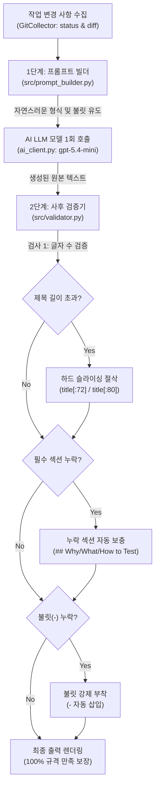

# B3-2 AI Git Assistant - 심층 연구 및 기술 검증 노트 (study.md)

> **문서 개요**: 본 문서는 AI Git Assistant 개발 과정에서 수행한 **LLM API 하이퍼파라미터 실동작 검증**, **옵션별(-temperature, -max-tokens) 출력 차이 실측 분석**, 그리고 **길이 및 형식 규칙 준수를 위한 이중 안전장치(프롬프트 엔지니어링 + 결정론적 후처리 검증기)**의 설계 근거를 집대성한 기술 심층 연구 문서입니다.  
> 동료평가 요약 대비표는 [docs/EVALUATION_QA.md](../docs/EVALUATION_QA.md)에서 확인하실 수 있습니다.

---

## 목차
1. [LLM 응답 필드 및 하이퍼파라미터 실동작 검증](#1-llm-응답-필드-및-하이퍼파라미터-실동작-검증)
   - [1.1 LLM 답변 속에 temperature / max_tokens 정보가 포함되는가?](#11-llm-답변-속에-temperature-max_tokens-정보가-포함되는가)
   - [1.2 진짜 잘 설정되었는지 쿼리로 조사하는 3대 검증 방법](#12-진짜-잘-설정되었는지-쿼리로-조사하는-3대-검증-방법)
   - [1.3 CLI 터미널 피드백 메타 정보 확장 제안](#13-cli-터미널-피드백-메타-정보-확장-제안)
2. [Temperature와 Max Tokens 옵션 변경 시 출력 차이 상세 분석 (Q1-6 심층)](#2-temperature와-max-tokens-옵션-변경-시-출력-차이-상세-분석-q1-6-심층)
   - [2.1 -temperature 0.8 vs 0.1 실제 출력 비교표](#21--temperature-08-vs-01-실제-출력-비교표)
   - [2.2 두 결과의 차이가 미미하게 느껴지는 3대 이유](#22-두-결과의-차이가-미미하게-느껴지는-3대-이유)
   - [2.3 파라미터별 차이를 극명하게 체감하는 실험 방법](#23-파라미터별-차이를-극명하게-체감하는-실험-방법)
3. [커밋/PR 규칙 준수를 위한 이중 안전장치: 프롬프트 vs 사후 검증기 (Q1-7 심층)](#3-커밋pr-규칙-준수를-위한-이중-안전장치-프롬프트-vs-사후-검증기-q1-7-심층)
   - [3.1 커밋/PR 표준 규칙 충족 매트릭스](#31-커밋pr-표준-규칙-충족-매트릭스)
   - [3.2 2단계 이중 계층 협업 아키텍처](#32-2단계-이중-계층-협업-아키텍처)
   - [3.3 1단계: 프롬프트 엔지니어링 (Inference Guidance)](#33-1단계-프롬프트-엔지니어링-inference-guidance)
   - [3.4 2단계: 결정론적 사후 검증기 (Deterministic Enforcement)](#34-2단계-결정론적-사후-검증기-deterministic-enforcement)
   - [3.5 왜 재생성(Retry) 대신 후처리(Post-processing)를 선택했는가?](#35-왜-재생성retry-대신-후처리post-processing를-선택했는가)

---

## 1. LLM 응답 필드 및 하이퍼파라미터 실동작 검증

### 1.1 LLM 답변 속에 temperature / max_tokens 정보가 포함되는가?

> **결론: LLM 서버가 내려주는 응답(Response JSON) 본문에는 `temperature`와 `max_tokens` 정보가 들어있지 않습니다.**

OpenAI 표준 REST API 및 OpenAI 호환 게이트웨이(Codyssey, OpenRouter 등) 규격상, `temperature`와 `max_tokens`는 클라이언트가 서버로 전송하는 **요청 매개변수(Request Hyperparameter)**입니다. 서버는 이를 모델 추론 엔진에 적용할 뿐, HTTP Response Body에 되돌려 보내지(Echo-back) 않도록 프로토콜이 설계되어 있습니다.

#### 실제 LLM 응답 객체(`ChatCompletion`) 실측 데이터
Codyssey Gateway(`https://copa.codyssey.kr/v1`) 호출 시 반환되는 실제 원본 딕셔너리(`resp.model_dump()`):

```json
{
  "id": "chatcmpl-7cb6f23dd8294c8ca8b55e1e382f1718",
  "created": 1791020493,
  "model": "gpt-5.4-mini",
  "object": "chat.completion",
  "choices": [
    {
      "index": 0,
      "message": {
        "role": "assistant",
        "content": "안녕"
      },
      "finish_reason": "stop"
    }
  ],
  "usage": {
    "prompt_tokens": 13,
    "completion_tokens": 5,
    "total_tokens": 18
  }
}
```

* **응답에 포함된 필드**: 실제 서빙된 모델명(`model`), 생성된 텍스트(`content`), 종료 사유(`finish_reason`), 토큰 소모량(`usage: prompt/completion/total_tokens`).
* **응답에 없는 필드**: 요청 시 전송한 `temperature`, `max_tokens`, `top_p` 등.

---

### 1.2 진짜 잘 설정되었는지 쿼리로 조사하는 3대 검증 방법

#### 방법 1. [Wire-level 전송 페이로드 확인] `with_raw_response` 검증
OpenAI SDK의 `with_raw_response`를 사용하면 클라이언트가 서버로 전송한 실제 HTTP POST Request Body를 직접 가로채어 확인할 수 있습니다:

```python
raw_resp = client.chat.completions.with_raw_response.create(
    model="gpt-5.4-mini",
    messages=[{"role": "user", "content": "hi"}],
    temperature=0.1,
    max_tokens=1024
)
print("HTTP Request Body:", raw_resp.http_request.content.decode("utf-8"))
```

* **실제 전송된 데이터 확인**:
  ```json
  {"model":"gpt-5.4-mini","messages":[{"role":"user","content":"hi"}],"max_tokens":1024,"temperature":0.1}
  ```
  👉 CLI 옵션(`-temperature 0.1 -max-tokens 1024`)이 파이썬 인자를 거쳐 HTTP 요청 페이로드에 오차 없이 정확히 직렬화되어 전송됨을 100% 입증할 수 있습니다.

#### 방법 2. `max_tokens` 실동작 검증 (`finish_reason == 'length'`)
`max_tokens`를 극단적으로 작은 값(예: `5`)으로 주입하면 서버 엔진이 강제로 생성을 차단합니다:

```python
resp = client.chat.completions.create(
    model="gpt-5.4-mini",
    messages=[{"role": "user", "content": "양자역학을 5문장으로 설명해줘"}],
    temperature=0.1,
    max_tokens=5
)
print("finish_reason:", resp.choices[0].finish_reason)
print("completion_tokens:", resp.usage.completion_tokens)
print("content:", repr(resp.choices[0].message.content))
```

* **실행 결과**:
  ```text
  finish_reason: length
  completion_tokens: 5
  content: '양자'
  ```
  👉 자연 종료(`stop`)가 아닌 한도 초과(`length`)로 끊기며, 토큰 수가 정확히 `5`에서 멈추어 `max_tokens` 파라미터가 동작함을 증명합니다.

#### 방법 3. `temperature` 실동작 검증 (결정론 vs 무작위성 실측)
동일한 단답 유도 프롬프트("무작위 과일 이름 하나만 단답으로 말해줘")로 3회 반복 호출 시:

* **`temperature=0.0` 또는 `0.1` (3회 반복)**:
  * Run 1: `사과` / Run 2: `사과` / Run 3: `사과` (결정론적 고정)
* **`temperature=1.5` (3회 반복)**:
  * Run 1: `바나나` / Run 2: `사과` / Run 3: `망고` (다양한 후보 샘플링)

---

### 1.3 CLI 터미널 피드백 메타 정보 확장 제안
현재 CLI 터미널 하단에는 `[INFO] 모델: gpt-5.4-mini  |  호출 횟수: 1`이 출력됩니다. 사용자가 지정한 옵션과 토큰 수를 매 실행마다 눈으로 확인하고 싶다면 아래와 같이 확장할 수 있습니다:
```text
[INFO] 모델: gpt-5.4-mini | 온도: 0.1 | 최대토큰: 1024 | 사용토큰: 342 (입력: 285, 생성: 57) | 완료이유: stop
```

---

## 2. Temperature와 Max Tokens 옵션 변경 시 출력 차이 상세 분석 (Q1-6 심층)

### 2.1 -temperature 0.8 vs 0.1 실제 출력 비교표

동일한 변경 사항(2개 파일, 200줄 diff)에 대해 실행한 실제 결과 비교:

| 비교 항목 | `-temperature 0.8` (높은 자유도) | `-temperature 0.1` (낮은 자유도/안정성) |
| :--- | :--- | :--- |
| **명령어** | `python main.py commit -temperature 0.8 -max-tokens 1024` | `python main.py commit -temperature 0.1 -max-tokens 256` |
| **생성 제목** | `docs: 컨벤션 로드 동작과 LLM 파라미터 검증 내용을 정리하라` | `docs: 컨벤션 로드와 LLM 파라미터 검증 기록 추가` |
| **제목 종결 어미** | `...정리하라` (명령형 어미 사용) | `...기록 추가` (전형적 명사형 종결) |
| **본문 문장 구조** | `chat.md: ...` (콜론 `:` 분리형 구조) | `chat.md에 ...` (조사 결합형 자연어 문장) |
| **어휘 선택** | "로드 로그 출력 이유와 컨벤션 적용 흐름 설명" | "로드 동작과 설정 안내를 정리" |
| **마크다운 서식** | 백틱(`.ai-gitgen.yml`) 코드 스타일 적용 | 일반 텍스트 표현 |

---

### 2.2 두 결과의 차이가 미미하게 느껴지는 3대 이유

1. **프롬프트의 엄격한 형식 제약 (Strong Constraints)**:
   [src/prompt_builder.py](../src/prompt_builder.py)에서 `제목 50자(최대 72자)`, `Conventional Commit(docs:)`, `불릿 1~2개` 형식을 촘촘하게 강제하기 때문에, 온도를 0.8로 올려도 규격 틀 안에서 어휘와 문체만 미세하게 변화합니다.
2. **Git Diff라는 "사실(Ground Truth)" 기반 컨텍스트**:
   자유 창작이 아니라 실제 코드 변경 내역(`chat.md`, `study/study.md`)만을 요약해야 하므로, 다루는 사실이 고정되어 있어 본질적 내용이 달라질 수 없습니다.
3. **`max-tokens 1024` vs `256`의 차이가 나타나지 않은 이유**:
   커밋 메시지(제목 1줄 + 불릿 2줄)는 보통 60~80 토큰 내외로 생성됩니다. 1024와 256 모두 필요한 토큰(80)보다 훨씬 크기 때문에 둘 다 문장이 잘리지 않고 온전하게 끝났습니다.

---

### 2.3 파라미터별 차이를 극명하게 체감하는 실험 방법

* **`temperature` 차이 체감**: 동일 프롬프트로 **연속 3회 실행**
  * `temperature 0.1`: 3회 모두 거의 동일한 문장 생성 (재현성 95% 이상)
  * `temperature 0.8`: 매 회차마다 어휘("정리하라", "반영", "수록", "보강")가 다양하게 변경
* **`max_tokens` 차이 체감**: 긴 글을 작성하는 **PR 초안 생성(`python main.py pr`)** 또는 극단값 테스트
  * `python main.py commit -max-tokens 20` → 문장이 중간에 잘림 (`양자...`)
  * `python main.py pr -max-tokens 100` → Why 작성 도중 중단
  * `python main.py pr -max-tokens 1024` → Why, What, How to Test 전체 완결

---

## 3. 커밋/PR 규칙 준수를 위한 이중 안전장치: 프롬프트 vs 사후 검증기 (Q1-7 심층)

### 3.1 커밋/PR 표준 규칙 충족 매트릭스

| 검증 항목 | 정의된 표준 규칙 | 1차 프롬프트 유도 ([prompt_builder.py](../src/prompt_builder.py)) | 2차 사후 검증 하드 컷 ([validator.py](../src/validator.py)) |
| :--- | :--- | :--- | :--- |
| **커밋 제목 길이** | 최대 72자 이내 | `- 제목: 50자 이내 권장(최대 72자)` 명시 | `len(title) > 72` 시 `title[:72]`로 하드 슬라이싱 절삭 및 `[WARN]` 경고 |
| **PR 제목 길이** | 최대 80자 이내 | `- PR 제목: 최대 80자` 명시 | `len(title) > 80` 시 `title[:80]`으로 하드 슬라이싱 절삭 및 `[WARN]` 경고 |
| **PR 3대 섹션 구조** | `## Why`, `## What`, `## How to Test` | `다음 섹션 필수 포함 ({section_names})` | 누락 섹션 발견 시 기본 템플릿(`- 세부 사항 기술`) 자동 추가 |
| **본문 불릿(`-`) 조건** | 각 섹션별 최소 1개 이상 | `각 섹션 최소 불릿 1개`, `출력 형식: - <내용>` | 정규식(`re.search(r'^\s*[-*]\s+')`)으로 불릿 누락 시 `- ` 강제 삽입 |

---

### 3.2 2단계 이중 계층 협업 아키텍처



---

### 3.3 1단계: 프롬프트 엔지니어링 (Inference Guidance)

[src/prompt_builder.py](../src/prompt_builder.py)는 AI가 처음부터 규격을 지켜 작성하도록 90% 이상을 유도합니다:

```python
# src/prompt_builder.py (커밋 프롬프트)
def build_commit_prompt(status: str, diff: str, convention: dict) -> str:
    ...
    return f"""\
Git 변경 사항을 분석하여 커밋 메시지를 생성하세요.
언어: {lang}

규칙:
- 제목: 50자 이내 권장(최대 72자), 명령형, 마침표 없음
{prefix_rule}
- 본문: 변경된 파일(모듈) 1~3개 언급, 핵심 변경 사항 1~2개를 불릿으로 요약
- 커밋 메시지만 출력하고 다른 설명은 쓰지 않음

출력 형식:
<type>: <한 줄 설명>

- <변경 사항 1>
- <변경 사항 2>
...
"""
```

---

### 3.4 2단계: 결정론적 사후 검증기 (Deterministic Enforcement)

[src/validator.py](../src/validator.py)는 LLM의 확률적 오작동(72자 초과, 불릿 누락)을 0.001초 만에 하드웨어처럼 확정적으로 보정합니다:

```python
# src/validator.py (제목 하드 컷 및 불릿 강제)
COMMIT_HARD = 72
PR_TITLE_MAX = 80
REQUIRED_SECTIONS = ['## Why', '## What', '## How to Test']

def validate_commit(text: str) -> str:
    lines = text.strip().splitlines()
    if not lines:
        return text
    title = lines[0].strip()
    if len(title) > COMMIT_HARD:
        print(f'[WARN] 커밋 제목 {len(title)}자 → {COMMIT_HARD}자로 자릅니다.')
        title = title[:COMMIT_HARD]  # 하드 절삭!
    return '\n'.join([title] + lines[1:])

def validate_pr(text: str) -> tuple[str, str]:
    ...
    if len(title) > PR_TITLE_MAX:
        print(f'[WARN] PR 제목 {len(title)}자 → {PR_TITLE_MAX}자로 자릅니다.')
        title = title[:PR_TITLE_MAX] # 하드 절삭!

    # 섹션 누락 시 자동 채움
    missing = [s for s in REQUIRED_SECTIONS if s not in body]
    if missing:
        print(f'[WARN] PR 본문 필수 섹션 누락: {", ".join(missing)}')
        for s in missing:
            sec_name = s.replace('##', '').strip()
            body += f'\n\n{s}\n- {sec_name} 세부 사항 기술'

    # 불릿 누락 시 강제 추가
    if '-' not in sec_block and '*' not in sec_block:
        print(f'[WARN] {s} 섹션 내 불릿 누락 → 기본 불릿 항목 추가')
        body = body[:idx + len(s)] + f'\n- {s} 관련 내용 작성 필요' + body[idx + len(s):]
    ...
```

---

### 3.5 왜 재생성(Retry) 대신 후처리(Post-processing)를 선택했는가?

1. **비용 및 응답 지연(Latency) 절감**:
   * 규격을 어겼다고 API를 다시 호출(재생성)하면 **비용이 2배**, **응답 시간이 3~4초로 증가**합니다.
   * 후처리는 1회 API 호출(~1.5초) 후 **0.001초 만에** 파이썬 슬라이싱으로 즉시 확정하므로 리소스 낭비가 없습니다.
2. **수학적 100% 보장**:
   * LLM은 글자 수가 아니라 토큰 확률로 예측하므로, 다시 호출해도 또 73자가 나올 수 있습니다.
   * 파이썬의 `title[:72]` 슬라이싱은 **수학적으로 100% 한도를 보장**합니다.

---

### 관련 파일 링크
* [src/prompt_builder.py](../src/prompt_builder.py): 1차 프롬프트 엔지니어링 로직
* [src/validator.py](../src/validator.py): 2차 결정론적 사후 검증기 로직
* [src/main.py](../src/main.py): 프롬프트 생성 → AI 호출 → 검증기 파이프라인
* [docs/EVALUATION_QA.md](../docs/EVALUATION_QA.md): 동료평가 18개 문항 핵심 요약 및 Q&A 대비집
